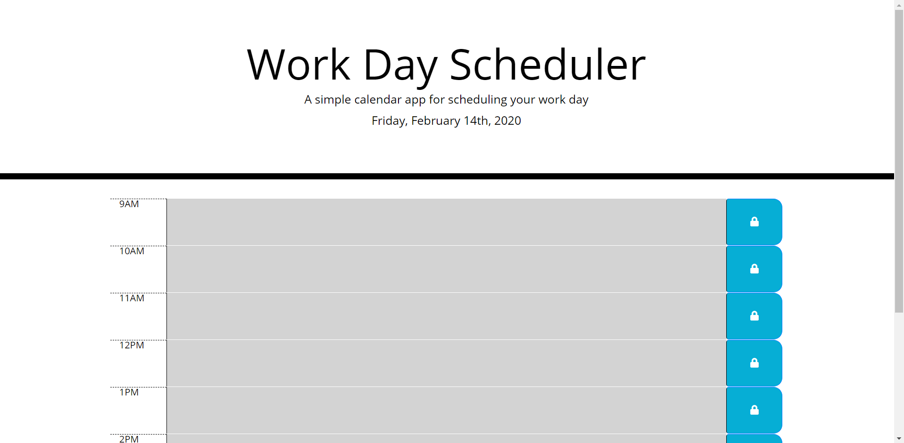
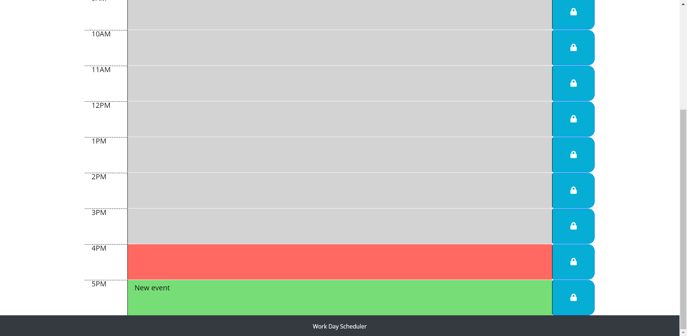

In this repository I developed a web application that allows the user to schedule important plans for a work day so they can manage their time more effectively. It contains rows for the hours 9AM-5PM, and these rows are color coded according to the current time, notifying the user whether that hour is in the past, present, or future. The user can add and remove plans to these rows. These plans are saved to local storage, and displayed in their respective rows upon refresh. I used the "Moment.js" library for this application.

[Here is a link to the application.](https://ethanl150.github.io/WorkDayScheduler/)

